# macOS Rime 鼠须管（Squirrel）输入法配置方案详解

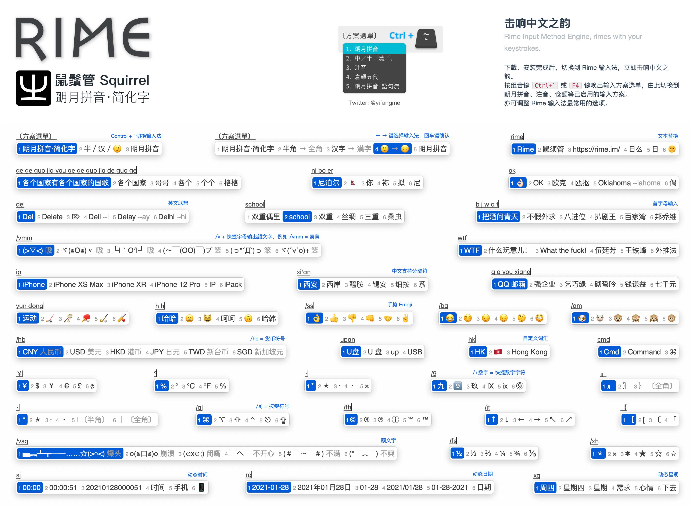

---

### 目录

1. [安装输入法](#一安装输入法) .......................................................................................................................................... Rime 官网
2. [定制输入法](#二定制输入法) ............................................................................................................................................ 配置文件
3. [皮肤主题](#三皮肤主题设置) ............................................................................................................................. squirrel.custom.yaml
4. [输入法切换](#四输入法切换) .......................................................................................................................... default.custom.yaml
5. [Emoji，自定义快捷字符](#五自定义快捷字符) ............................................................ Open 文件夹 和 luna_pinyin_simp.custom.yaml 
6. [词库设置](#六词库设置) ............................................................................................................. luna_pinyin.extended.dict.yaml
7. [搜狗词库转换方法](#七搜狗词库转换方法) ..................................................................................................... 后缀名为 `.dict.yaml` 文件
8. [App 默认英文输入](#八App-默认英文输入) ............................................................................................................... squirrel.custom.yaml
9. [输入动态时间、日期、星期](#九输入动态时间日期星期) .............................................................. rime.lua 和 luna_pinyin_simp.custom.yaml
10. [文本替换](#十文本替换) ................................................................................................................................. custom_phrase.txt
11. [模糊音](#十一模糊音) .................................................................................................................. luna_pinyin_simp.custom.yaml 

---

### 准备

1. 下载[配置文件](https://github.com/liuour/rime/archive/master.zip)并解压出【font】和【配置文件】，其他的都不需要。
2. Mac 不包含所有字体，防止个别字出现乱码，将【font】两个字体安装到 Mac 字体册。
3. 编辑器软件推荐使用  [Visual Studio Code](https://code.visualstudio.com/) 或 [Sublime Text](https://www.sublimetext.com/)。

---
### 一、安装输入法

下载 [Rime 鼠须管](https://dl.bintray.com/rime/squirrel/Squirrel-0.14.0.zip)安装包，初次安装，需注销并重新登录。

点选菜单栏输入法里的【ㄓ】图标，开始使用鼠须管输入法。

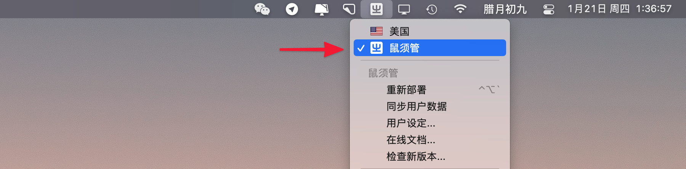

想要更好的输入体验，例如，更换皮肤，Emoji、添加词库、模糊音…完成下面定制设置。


---

### 二、定制输入法

点选【用户设定】打开目录文件。

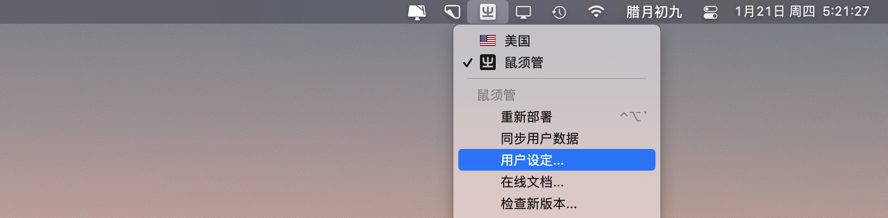

将【配置文件】粘贴到 Rime 目录文件内。

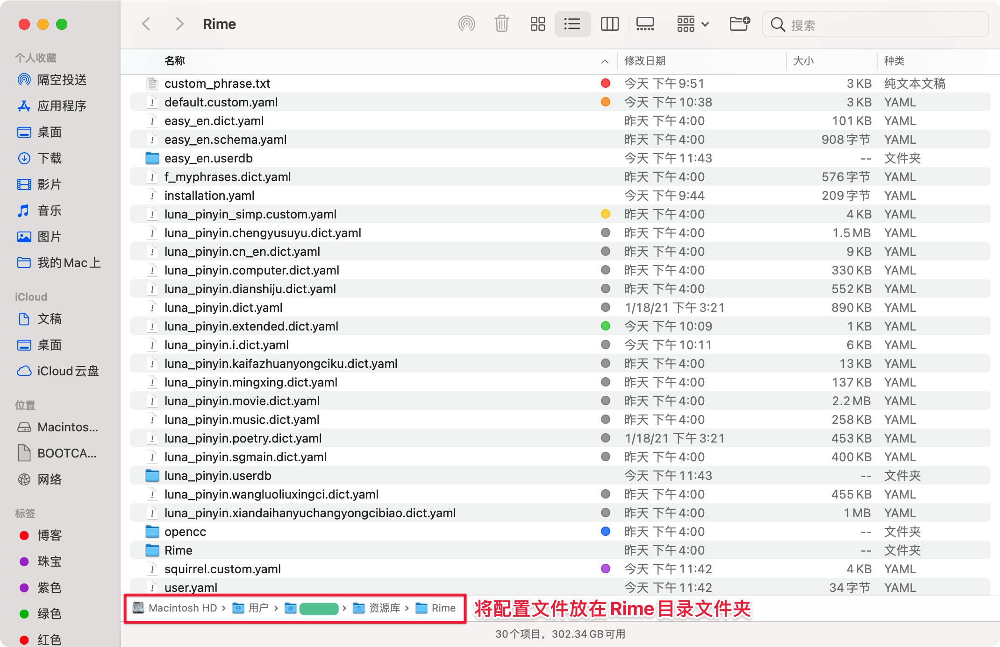

点击【重新部署】。

【注】修改任何文件都要重新部署（快捷键 `Control + Option + ｀`）。

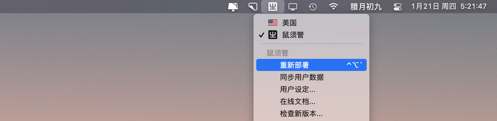

---
### 三、皮肤主题设置

用 `squirrel.custom.yaml` 保存皮肤主题的设置。

在 `style/color_scheme:` 后方输入皮肤名称来更换主题。

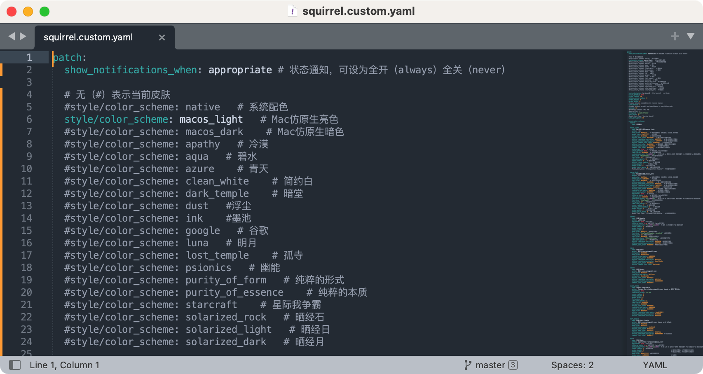

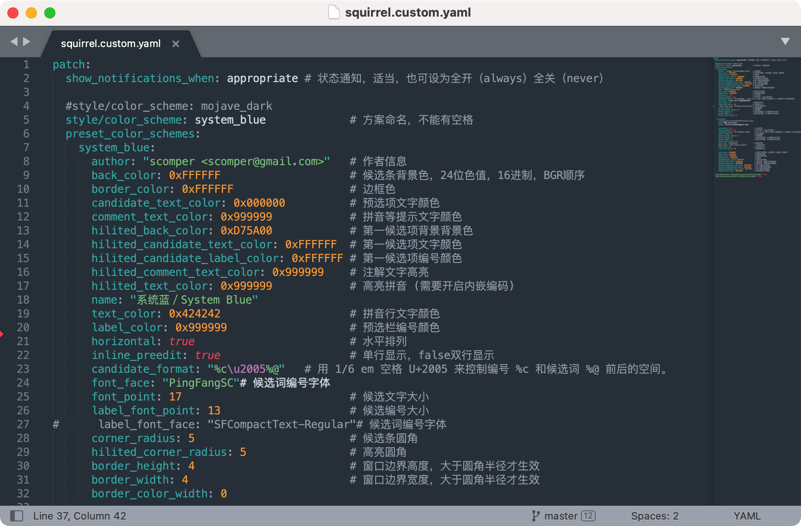

> 【附】更多皮肤效果图：[rime-pifu](https://github.com/liuour/rime-pifu)


**配色方法**

* 每 8bit 一组，从低位到高位分别代表 Red、Green、Blue、Alpha，共 32bit。
* Alpha 值（如果界面支持）是可选的，默认为 `0xF` F 即不透明。
* 把颜色值写为十六进制数，即 `0xAABBGGRR` 或 `0xBBGGRR`。

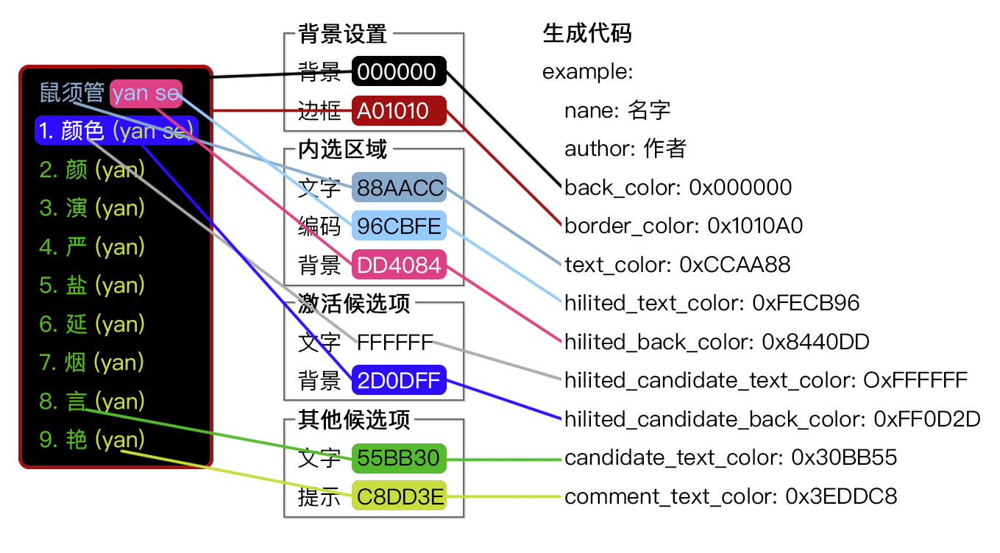

- 自定配色主题，产生代码的小工具：[Rime 西米 for Squirrel](https://gjrobert.github.io/Rime-See-Me-squirrel/)

---
### 四、输入法切换

快捷键 `Control +｀` 切换输入法方案。


用 `default.custom.yaml` 保存输入方案的设置。

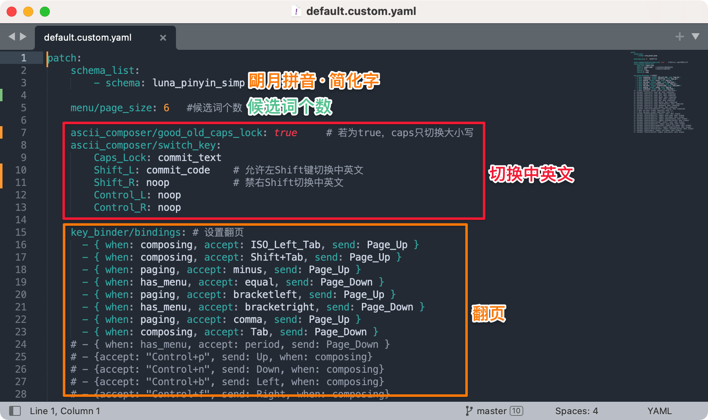

---

### 五、自定义快捷字符

以朙月拼音·简化字为例，用 `luna_pinyin_simp.custom.yaml` 保存快捷符号的设置。

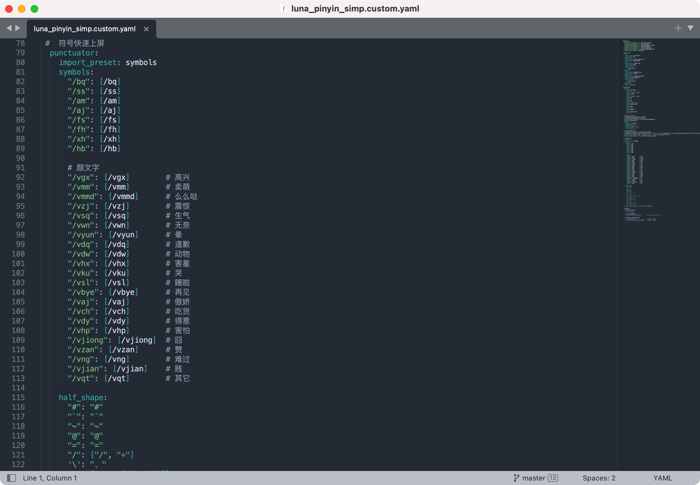

输入 `/bq` 显示表情。


输入 `/vmm` 显示卖萌颜文字。

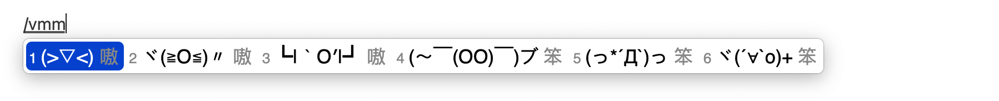

输入 `/hb` 显示货币符号。


在 opencc 文件夹内可以修改 Emoji、符号、颜文字、货币等。

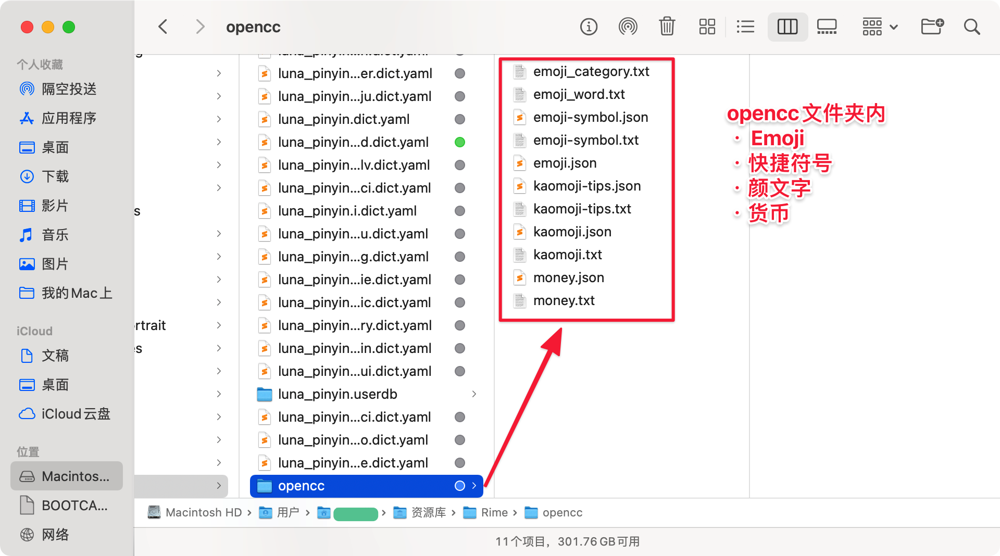

---

### 六、词库设置

用 `luna_pinyin.extended.dict.yaml` 保存词库的设置。

将词库名称去掉 `.dict.yaml` 添加进去，保存并重新部署。

示例：词库文件 `luna_pinyin.sgmain.dict.yaml`，输入 `- luna_pinyin.sgmain` 即可。

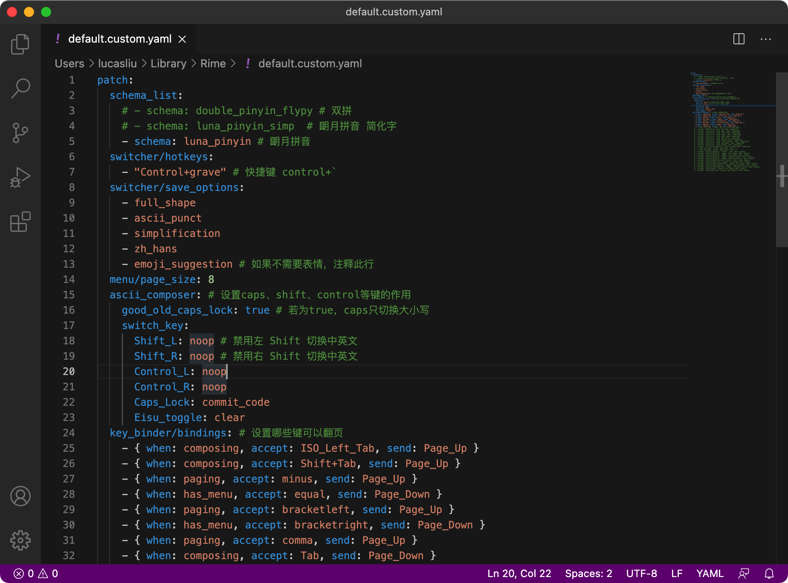

---
### 七、搜狗词库转换方法
打开[搜狗词库](https://pinyin.sogou.com/dict/)下载 `.scel` 词库文件。

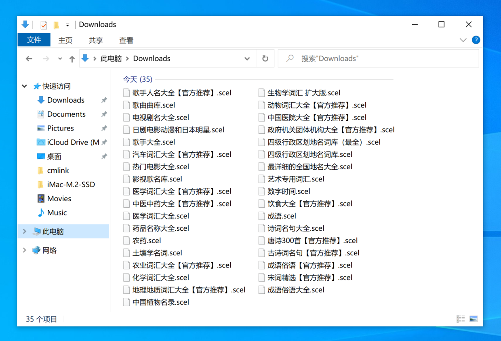

下载深蓝词库转换工具 [imewlconverter_Windows.zip](https://github.com/studyzy/imewlconverter/releases) 并打开。

选择 `.scel` 词库文件，点击打开。

> 注：如果工具识别不到词库，请选择所有格式。

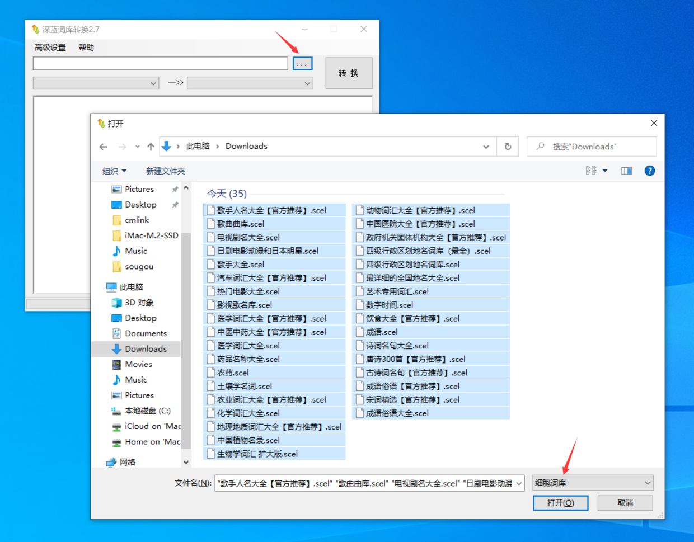

选择【搜狗细胞词库 scel】—>>【Rime 中州韵】，类型选择【拼音】【macOS】，点击确定，再点击转换。

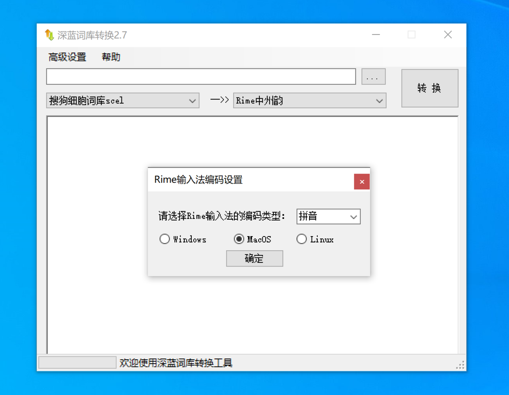

生成 `.txt` 文件（也可以选择多个词库生成一个 `txt` 文件）。

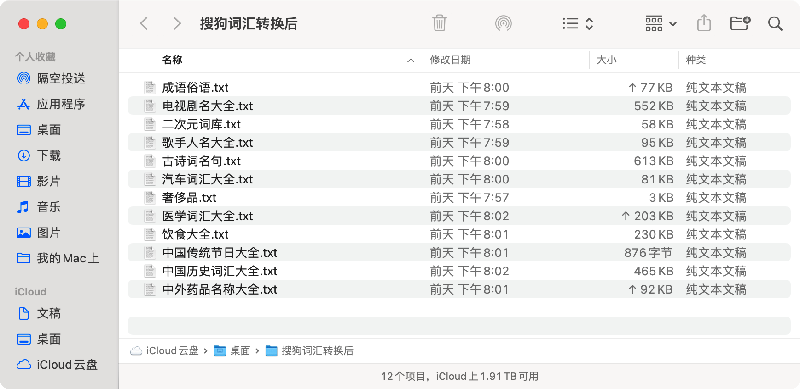

将下面代码粘贴在 `txt` 文档（可以将关键词写进去，防止以后添加词库重复）里最上方。

【注】最后一行 `∙∙∙` 后面加一个换行。

```
# Rime dictionary
# encoding: utf-8
# 搜狗词库 目前包含如下：
# 成语俗语（将词库名称输入到此处，方便日后检查是否重复）

---
name: luna_pinyin.sgmain
version: "2021.01.21"
sort: by_weight
use_preset_vocabulary: true
...

```
然后保存为 `luna_pinyin.sgmain.dict.yaml` 并放在 Rime 目录文件内，再参考[【六、词库设置】](#六词库设置)添加。

---

### 八、App 默认英文输入

用 `squirrel.custom.yaml` 最底部设置 App 默认英文输入。

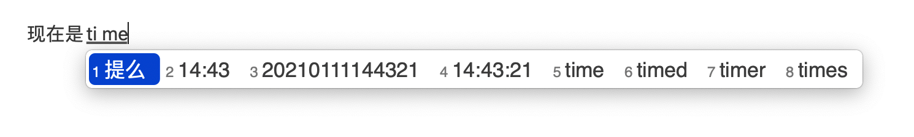


---

### 九、输入动态时间、日期、星期

将 rime.lua 文件添加在 Rime 目录文件内（本配置文件里已包含），可根据自己喜好修改时间、日期、星期快捷词语。

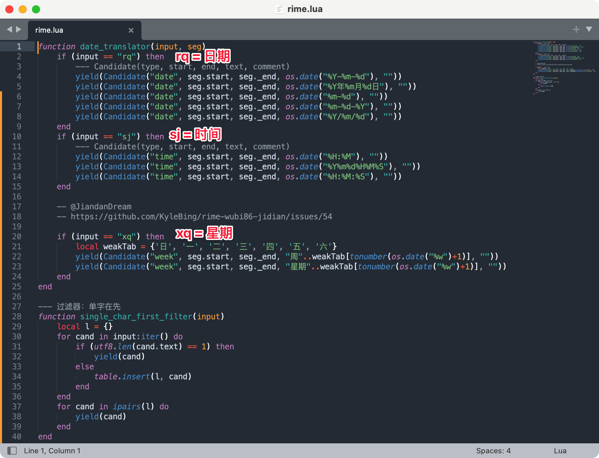

在对应的输入方式里加入下面代码，例如，朙月拼音简化字，就添加在 `luna_pinyin_simp.custom.yaml` 里。

```
# librime-lua 输入动态时间和日期
  engine/translators/+: 
    - lua_translator@date_translator
    - lua_translator@time_translator
```

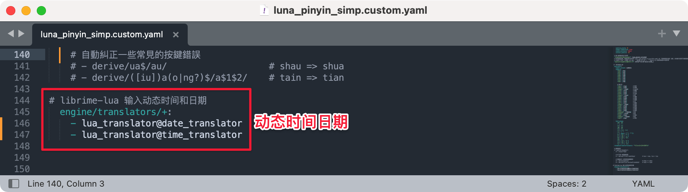


---

### 十、文本替换

在 `custom_phrase.txt` 设置文本替换。

> 顺序：`文字` `编码` `权重`（数字越大排序越靠前，可选）。短语使用 `Tab` 键分隔。


叠字输入。


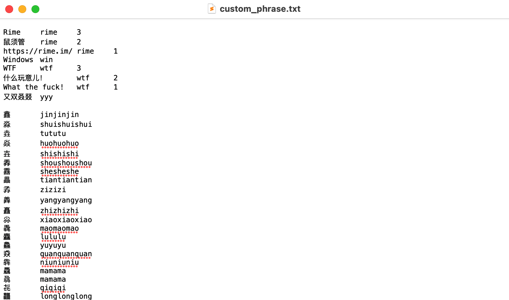

---

### 十一、模糊音

在 `luna_pinyin_simp.custom.yaml ` 里设置模糊音。

去掉代码前方的 `#` 保存并重新部署即生效模糊音。

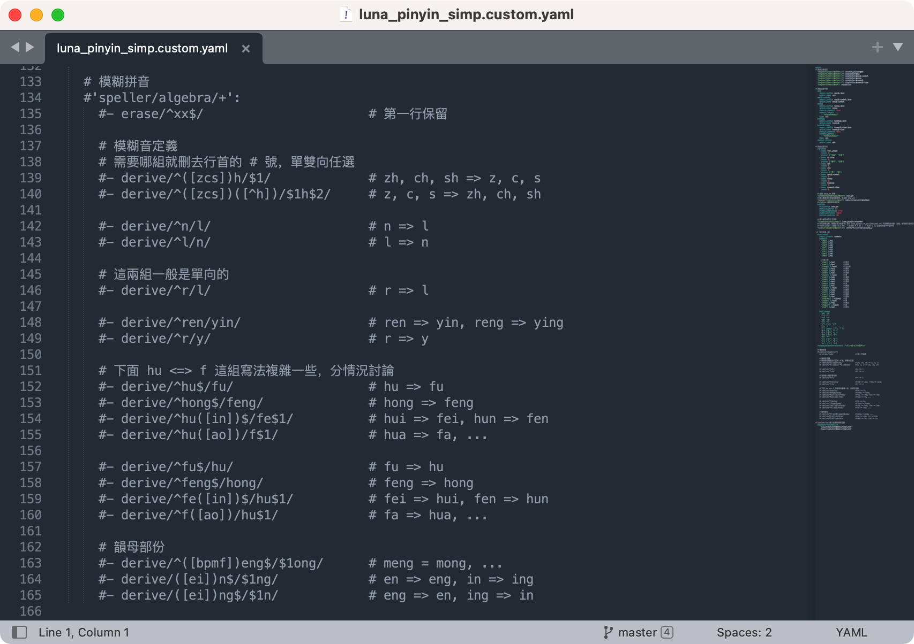

---

资源参考：

* Rime 官网： https://rime.im/
* lotem Squirrel：[https://github.com/rime/squirrel](https://github.com/rime/squirrel)
* 皮肤：[https://github.com/rime/squirrel/blob/master/data/squirrel.yaml](https://github.com/rime/squirrel/blob/master/data/squirrel.yaml)
* 中英切换自定义：https://gist.github.com/lotem/2981316
* grasonchan 鼠须管朙月拼音配置文件：[https://github.com/grasonchan/squirrel-config](https://github.com/grasonchan/squirrel-config)
* KyleBing Rime 五笔输入法：[https://github.com/KyleBing/rime-wubi86-jidian](https://github.com/KyleBing/rime-wubi86-jidian)

---

Rime 鼠须管交流群：[Telegram](https://t.me/rimesquirrel)

