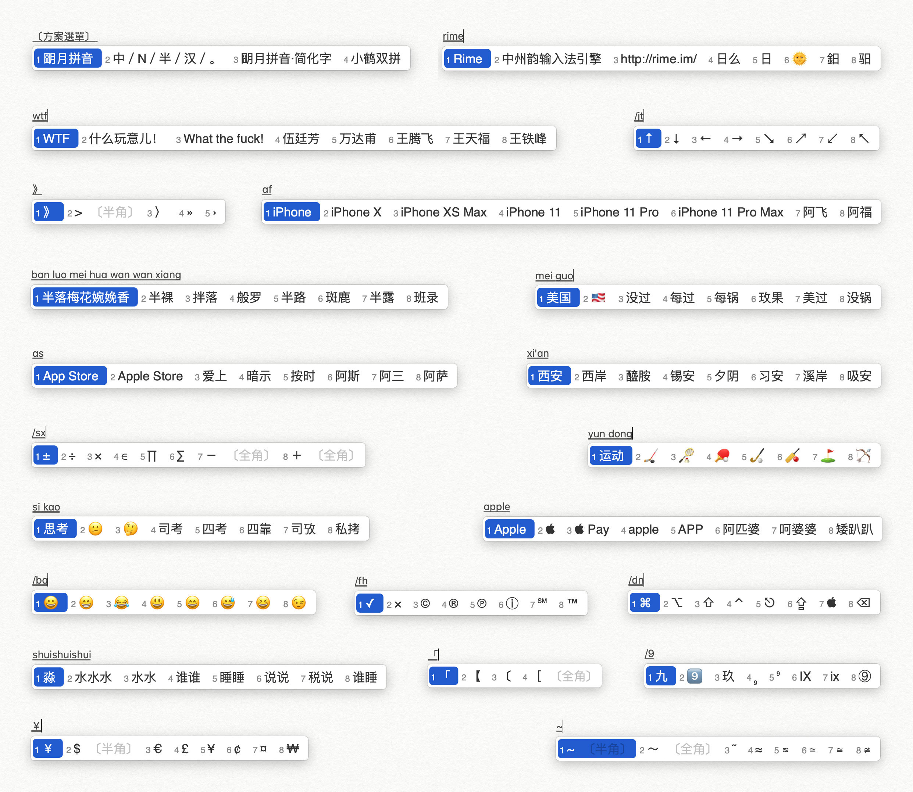

# Rime 鼠须管输入法 for Mac 配置方案
## 效果展示

## 一、安装输入法
* 前往 [Rime 官网](https://rime.im/)下载并安装，安装好后 Mac 重启或退出重新登录。

## 二、安装字体

* 下载后将【字体】文件夹内的 `两个字体文件` 拖到 Mac【字体册】完成安装。

## 三、配置文件
1. 菜单栏【前往】>【前往文件夹…】，输入 `~/Library/Rime`，点击【前往】，进入 Rime 目录文件。
2. 将【Rime 配置文件】内所有文件复制粘贴到 Rime 目录文件夹内。
3. 点击鼠须管【重新部署】完成。

>按 `Control + ~`选择 `朙月拼音`，可以切换输入法方案

## 四、配置文件介绍
配置文件内包含各种设置和词库，可以根据个人需求进行修改。
> 任何修改后，都要点击鼠须管【重新部署】方可生效

* `custom_phrase.txt`	【设置文本替换】
* `luna_pinyin.schema.yaml`	【设置表情、符号】
* `default.custom.yaml`【设置输入法，切换，翻页键，禁用 Shift 等】
* `squirrel.custom.yaml`	【设置皮肤，软件默认英文】
* `luna_pinyin.extended.dict.yaml`	【设置词库】
* `Open文件夹`【设置候选词表情】

