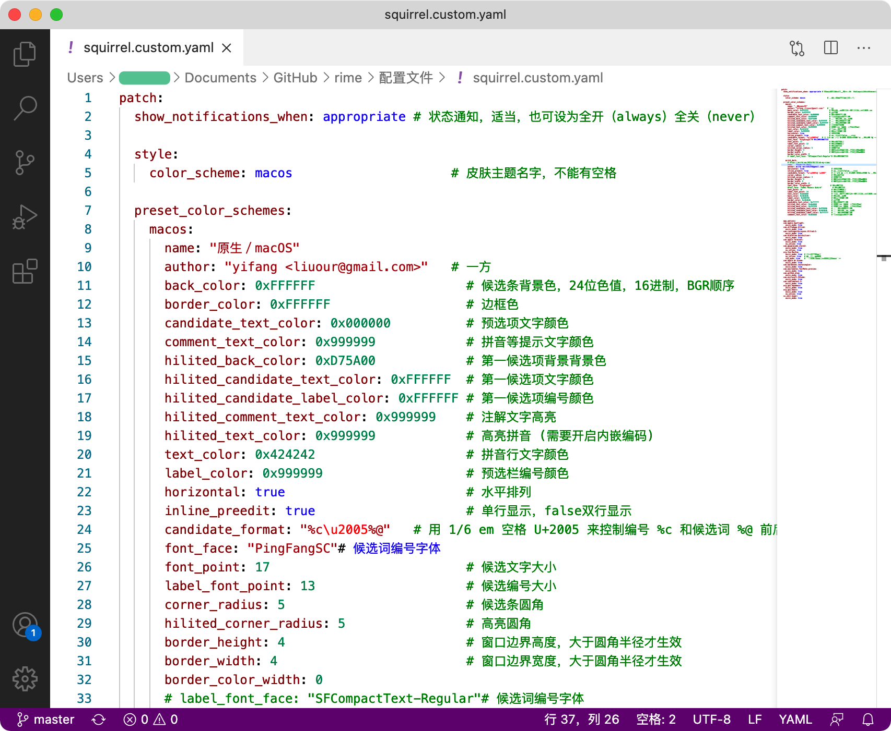
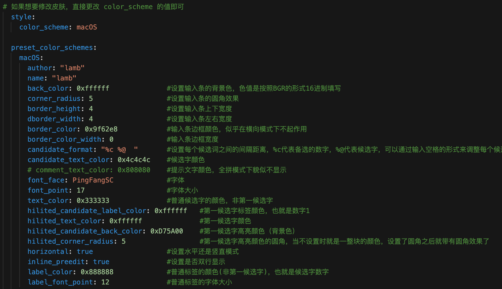
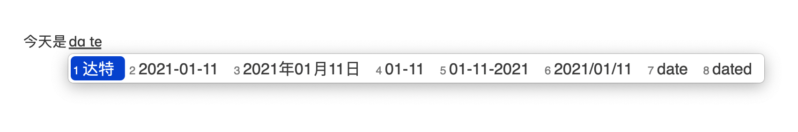

# Rime 输入法（鼠须管） for Mac 配置方案
#### Telegram 交流群：[点击加入](https://t.me/joinchat/G7mF0SxORWbgzSUS)

## 一、安装

1. 前往 [Rime](https://rime.im/) 下载并安装好输入法。
3. 点击【用户设定】打开 Rime 目录文件夹（为防止操作不当引起错误，可将此目录文件备份）。

3. 将【配置文件】里所有文件粘贴覆盖到 Rime 目录文件夹内。
4. 点击【重新部署】完成。

* 按 `Control` + `~` 选择输入法方案。
* 将【字体】文件夹内的 2 个文件安装到 Mac【字体册】。

## 二、皮肤

打开 `squirrel.custom.yaml` 修改皮肤参数。

#### 皮肤颜色

少数情况下会遇到 `0x` 开头的颜色值，比如 Rime 输入法里 `hilited_candidate_back_color: 0xD05B21`，末尾的 `0xD05B21` 表示第一候选词背景颜色。如果同一颜色输入不同表示方式，那么显示就会变化。

* 每 8bit 一组，从低位到高位分别代表 Red、Green、Blue、Alpha，共32bit。
* Alpha 值（如果界面支持）是可选的，默认为 `0xF` F 即不透明。
* 把颜色值写为十六进制数，即 `0xAABBGGRR` 或 `0xBBGGRR`。

### 三、按键

* 切换键盘
* 开启/禁用按键
* 翻页按键

### 四、输入系统 `时间` 和 `日期`

输入对应词，输出当前日期和时间

- `date` 输出日期，格式 `2021年01月11日`、 `2021-01-11`、 `01-11`、 `01-11-2021`、 `2021/01/11`
- `time` 输出时间，格式 `14:43` 、`20210111144321`、  `14:43:21` 

配置里 `rime.lua` 是时间日期文件，朙月拼音码表里找到 `engine/translators`，在下面添加 `lua_translator@date_translator`。

注：部分配置文件源自Rime官方和网络。

