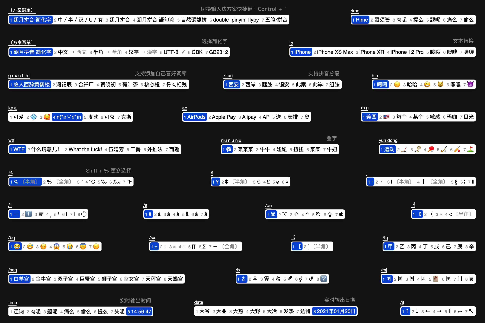

# Rime 输入法（鼠须管） for Mac 配置方案

### 安装输入法

1. 前往 [rime.im](https://rime.im/) 下载，初次安装，需注销并重新登录。
2. 点选菜单栏里的【ㄓ】图标，开始使用鼠须管输入法打字。通过快捷键  Control + ` 呼出方案，切换输入方式。想要更好的体验请点选【用户设定】打开目录文件夹（为防止操作不当引起错误，可将此目录文件备份）。

3. 将【配置文件】里所有文件粘贴覆盖到 Rime 目录文件夹内。
4. 点击【重新部署】完成。

* 将【字体】文件夹内的 2 个文件安装到 Mac【字体册】。

### 皮肤

在 `squirrel.custom.yaml` 里修改。

少数情况下会遇到 `0x` 开头的颜色值，比如 Rime 输入法里 `hilited_candidate_back_color: 0xD05B21`，末尾的 `0xD05B21` 表示第一候选词背景颜色。如果同一颜色输入不同表示方式，那么显示就会变化。

* 每 8bit 一组，从低位到高位分别代表 Red、Green、Blue、Alpha，共32bit。
* Alpha 值（如果界面支持）是可选的，默认为 `0xF` F 即不透明。
* 把颜色值写为十六进制数，即 `0xAABBGGRR` 或 `0xBBGGRR`。

附：配置方案来自 @scomper，本文添加 `tab` 键翻页、皮肤参数修改更接近 macOS UI、添加更多词库和文本替换等。

Telegram 交流群：[加入](https://t.me/rimesquirrel)