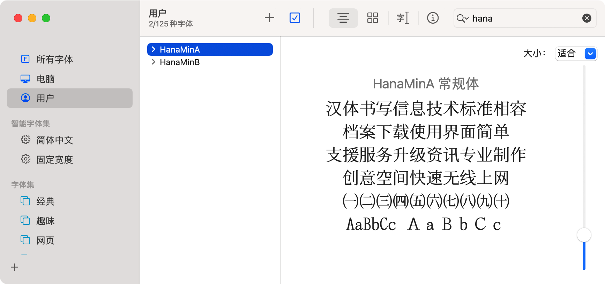
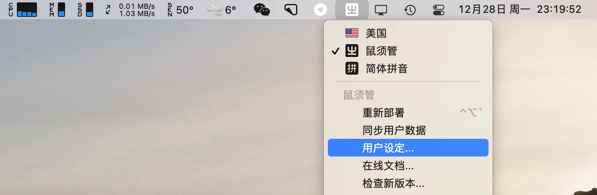
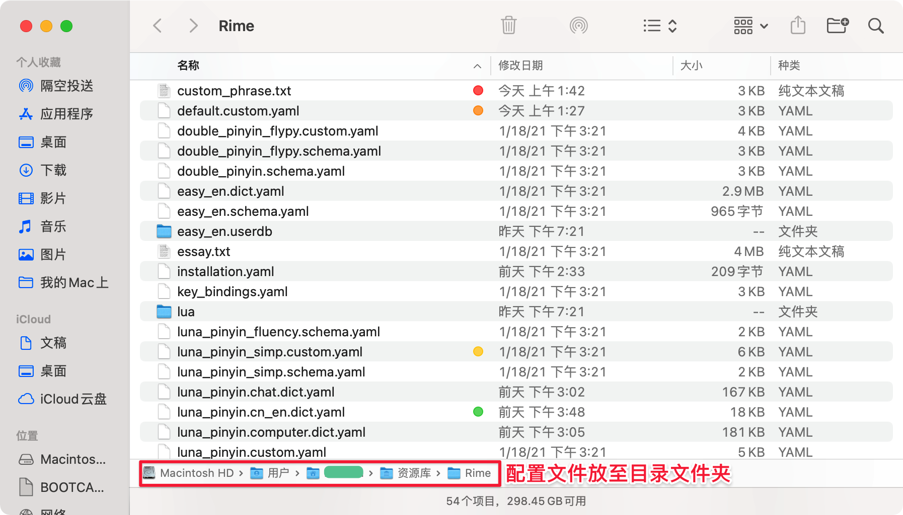
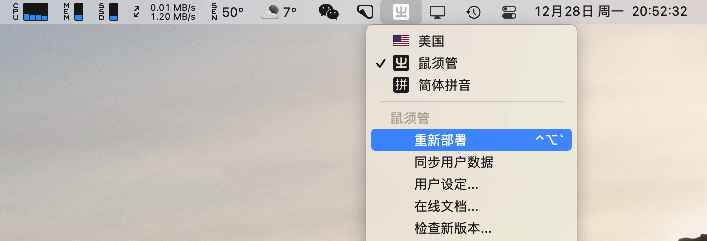
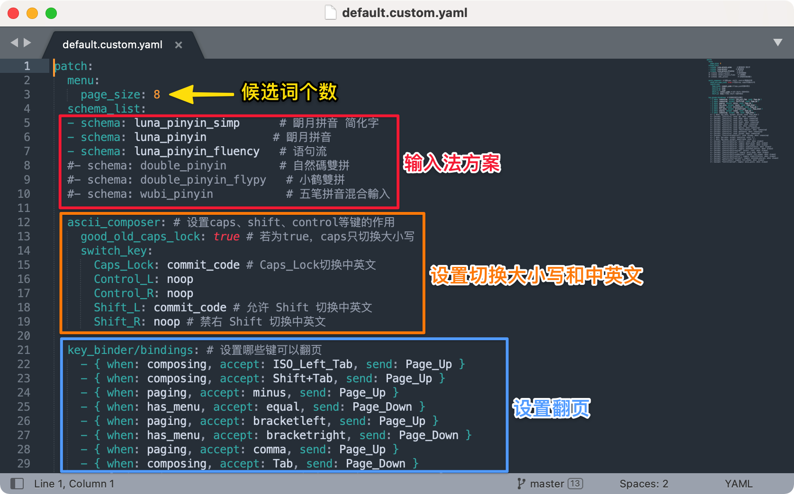
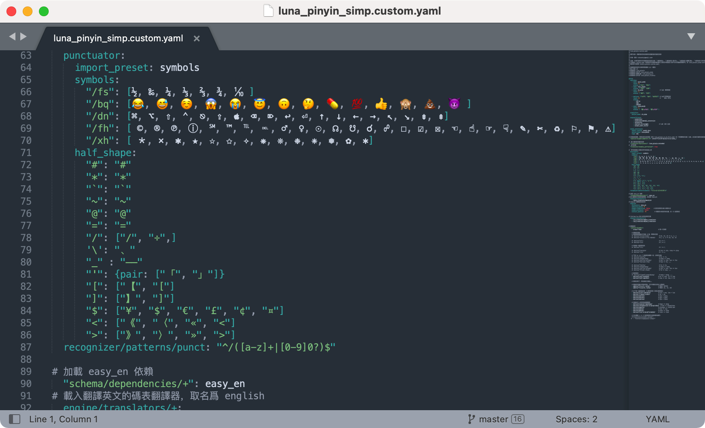
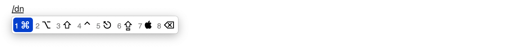
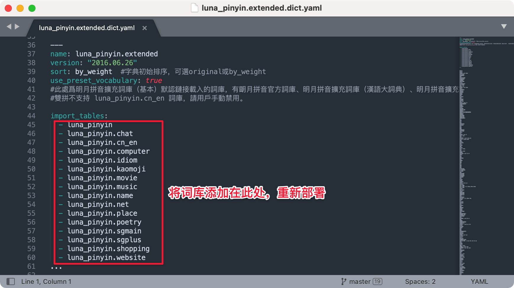

# Rime 输入法（鼠须管） for Mac 配置方案

### 准备：安装字体

防止部分字出现乱码，而 Mac 又不包含这些字体，将本帖文件【字体】内的两个字体安装到 Mac 字体册。

---
### 一、安装输入法

适用于 macOS 10.9+

前往 [rime.im](https://rime.im/) 下载，初次安装，需注销并重新登录。

点选菜单栏输入法里的【ㄓ】图标，开始使用鼠须管输入法。

---

### 二、定制输入法

点选【用户设定】打开目录文件（防止操作错误，可将此目录文件备份）。

将本帖文件【配置文件】粘贴到鼠须管目录文件夹内。

点击【重新部署】完成。

> 注：修改任何文件，都要点击重新部署（快捷键： `Control + Option + ｀`）才能生效。

---
### 三、皮肤主题设置

用 `squirrel.custom.yaml` 保存用户的设置。

可以添加自己的皮肤，格式代码详见 [Gist](https://gist.github.com/lotem/2290714)。

切换皮肤主题，只要在 `style/color_scheme:` 后方修改为相应的皮肤名称。

上图参数显示效果：

少数情况下会遇到 `0x` 开头的颜色值，比如 `hilited_candidate_back_color: 0xD05B21`，末尾的 `0xD05B21` 表示第一候选词背景颜色。如果同一颜色输入不同表示方式，那么显示就会变化。

* 每 8bit 一组，从低位到高位分别代表 Red、Green、Blue、Alpha，共32bit。
* Alpha 值（如果界面支持）是可选的，默认为 `0xF` F 即不透明。
* 把颜色值写为十六进制数，即 `0xAABBGGRR` 或 `0xBBGGRR`。

---
### 四、输入法方案

快捷键 `Control +｀` 调出方案。

用 `default.custom.yaml` 保存用户的设置。

---

### 五、自定义快捷字符

以朙月拼音简化字为例：用 `luna_pinyin_simp.custom.yaml` 保存用户的设置。

快捷键 `/+字母` 来输出快捷字符。

示例：输入 `/dn`，输出如下图。

---

### 六、词库设置

用 `luna_pinyin.extended.dict.yaml` 保存用户的设置。

词库文件以 `.dict.yaml` 结尾。

将词库放入目录文件夹后，添加词库时去掉 `.dict.yaml`。

示例：音乐词库 `luna_pinyin.music.dict.yaml`，添加时只需输入 `- luna_pinyin.music`。

---

附：配置方案来自scomper，本文做部分修改和添加词库。

Telegram 交流群：[加入](https://t.me/rimesquirrel)